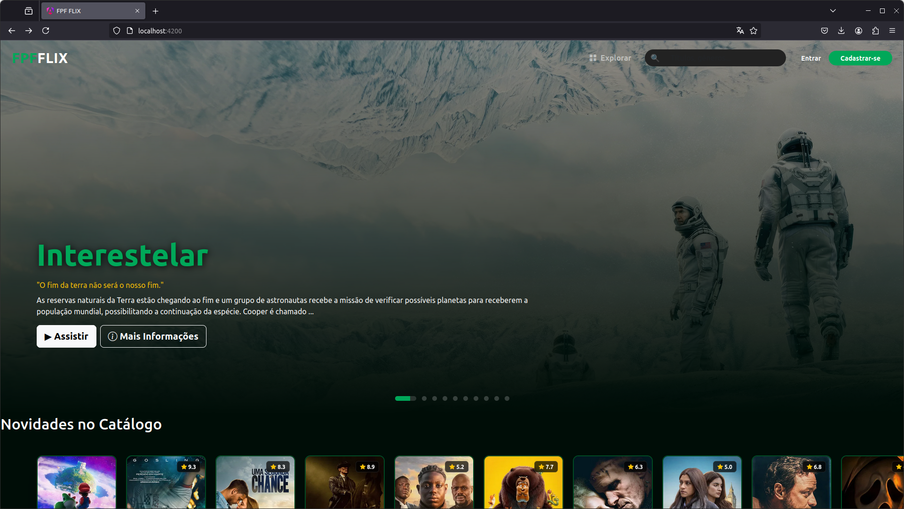
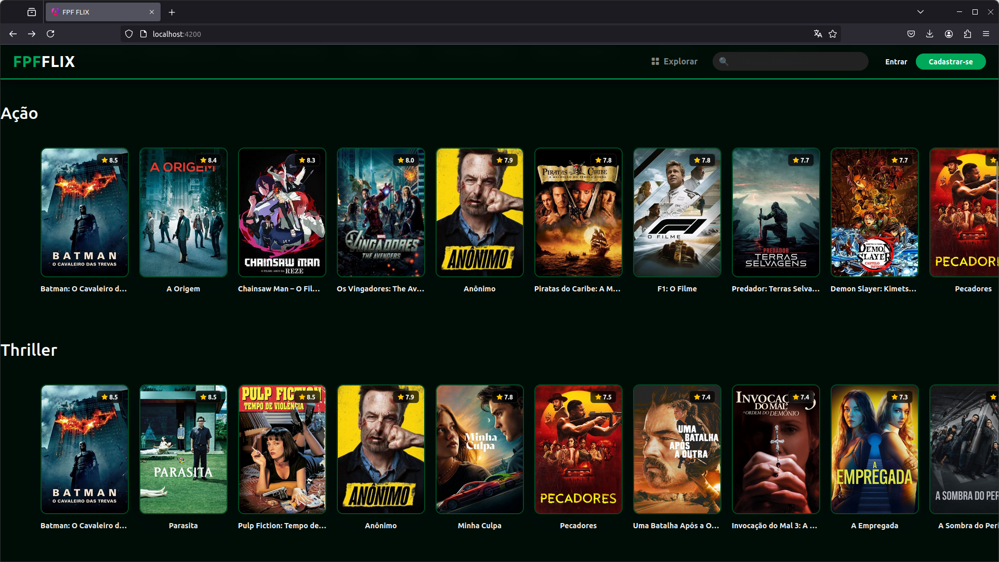
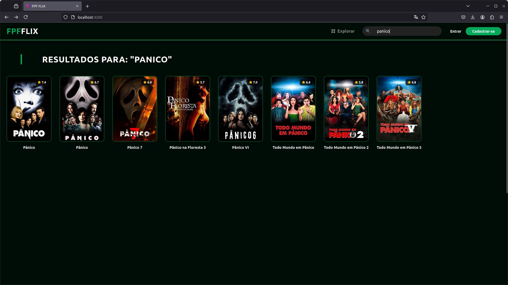
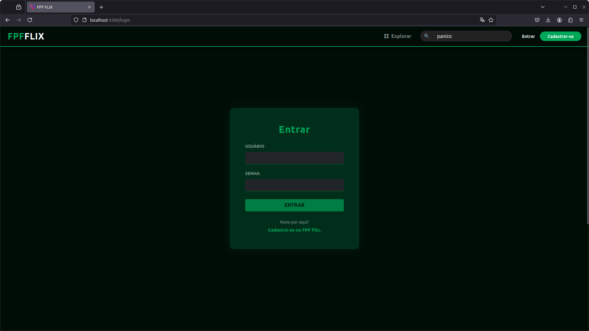
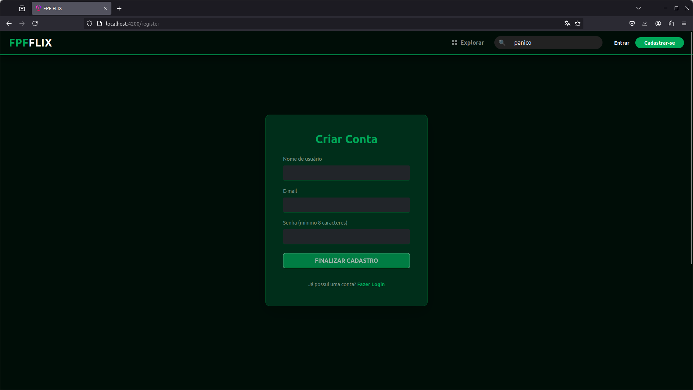
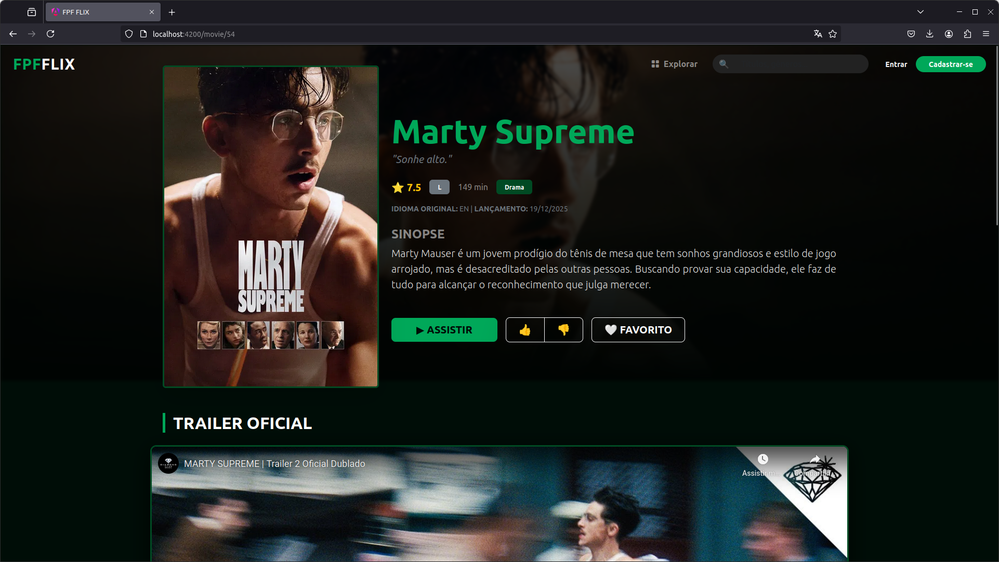
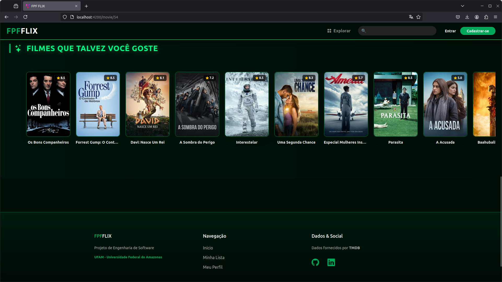
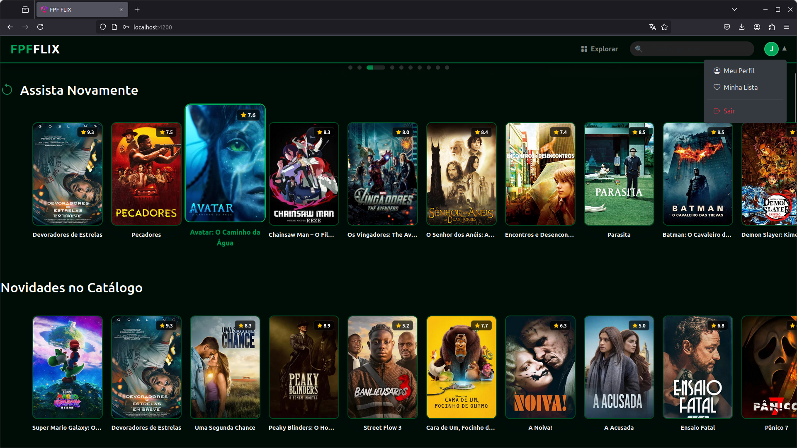
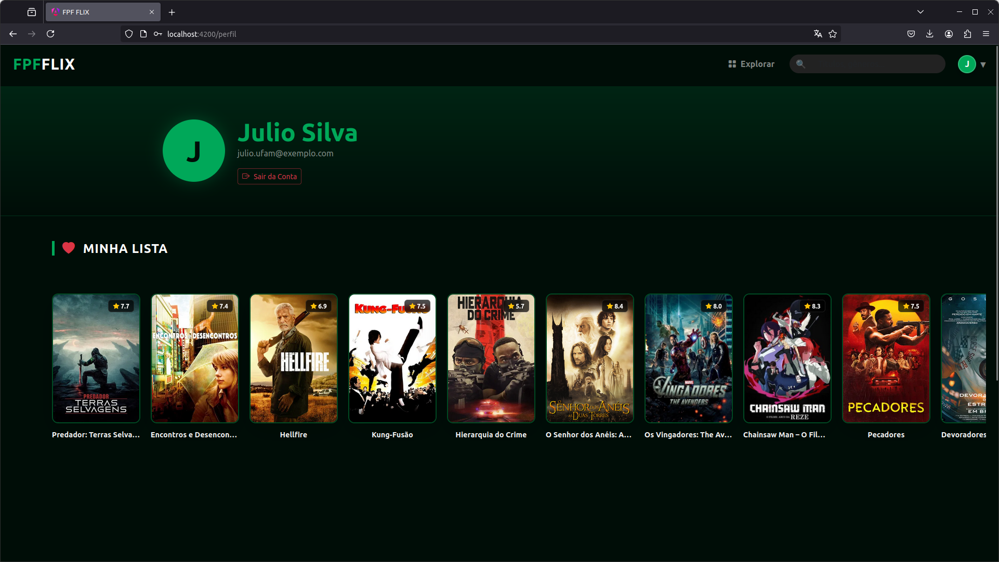

🎬 FpFlix - Streaming Platform

O **FpFlix** é uma plataforma de streaming completa (Full Stack) que oferece uma experiência imersiva de catálogo de filmes. O sistema foi projetado para ser dinâmico, consumindo dados reais da indústria cinematográfica e oferecendo recursos personalizados para o usuário.Feito como propotipo final para o curso de Desnvolvimento de Software da FpFTech.

### ✨ Principais Funcionalidades:

*   **🎬 Catálogo Inteligente:** Exibição de filmes organizados por gêneros populares, alimentados via integração com a API do TMDB.
*   **🔍 Busca em Tempo Real:** Sistema de filtragem dinâmica para encontrar títulos rapidamente.
*   **🔐 Autenticação Completa:** Fluxo seguro de **Login** e **Cadastro** de usuários com persistência de dados.
*   **👤 Perfis Personalizados:** Cada usuário possui sua área exclusiva para gerenciar sua conta.
*   **⭐ Sistema de Favoritos:** Lista personalizada onde o usuário pode salvar e remover filmes de sua preferência.
*   **🎥 Detalhes e Trailers:** Páginas dedicadas com sinopses, avaliações, duração e exibição de trailers oficiais.
*   **⚙️ Dashboard Administrativo:** Gestão de conteúdo e usuários através do painel robusto do Django.
O sistema consome a API do TMDB e gerencia favoritos, avaliações e perfis de usuário.
* 
🚀 Tecnologias

    Frontend: Angular 18+, Bootstrap 5, Sass.

    Backend: Django Rest Framework (Python).

    Banco de Dados: SQLite (Desenvolvimento).

    API Externa: TMDB (The Movie Database).

🛠️ Como rodar o projeto
1. Backend (Django)

O servidor de API gerencia os dados e a lógica de autenticação.

    Navegue até a pasta:
    cd BackEnd

    Crie e ative o ambiente virtual:
    python -m venv venv
    source venv/bin/activate  # No Windows use: venv\Scripts\activate

    Instale as dependências:
    pip install -r requirements.txt

    Configuração da API TMDB (Obrigatório):

        Crie um arquivo chamado .env na raiz da pasta BackEnd.

        Adicione sua chave do TMDB e a Secret Key do Django:
        TMDB_API_KEY=sua_chave_aqui
        SECRET_KEY=sua_secret_key_django
        DEBUG=True

    Prepare o Banco de Dados:
    python manage.py migrate

    Alimentar o Catálogo (Seed):
    Rode o comando customizado para buscar os filmes da API e salvar no seu banco local:
    python manage.py popular_banco

    Inicie o servidor:
    python manage.py runserver

📥 Automação e População do Banco

O projeto conta com um script de Data Seeding personalizado que automatiza a curadoria do catálogo, garantindo que o sistema não inicie vazio.

Como o script funciona:

    Integração com TMDB: Consome a API oficial do The Movie Database para buscar dados reais.

    Inteligência de Gêneros: Identifica automaticamente os 10 gêneros mais populares do momento e os cadastra no banco.

    Curadoria Automática: Filtra e baixa os 40 melhores filmes de cada gênero (totalizando 400 títulos iniciais).

    Validação de Dados: O script garante que apenas filmes com pôster, imagem de fundo (backdrop), sinopse e duração válida sejam importados, evitando "buracos" no layout.

    Enriquecimento: Realiza chamadas secundárias para buscar detalhes específicos, como a Tagline (frase de efeito) e o Runtime (duração em minutos).

2. Frontend (Angular)

A interface visual do usuário.

    Navegue até a pasta:
    cd FrontEnd

    Instale os pacotes:
    npm install

    Inicie o projeto:
    npx ng serve

    Acesse no navegador:
    http://localhost:4200

## 📸 Screenshots

Aqui estão as capturas de tela da plataforma FpFlix, mostrando desde o catálogo principal até os detalhes de cada título.

|               Home Page                |           Catálogo de Filmes           |             Busca Dinamica             |
|:--------------------------------------:|:--------------------------------------:|:--------------------------------------:|
|  |  |  |
|               **Login**                |              **Cadastro**              |           **Pagina detalhe**           |
|  |  |  |
|     **Fim pagina detalhe/Rodape**      |           **Usuario Logado**           |    **Perfil e Filmes favoritados**     |
|  |  |  |

